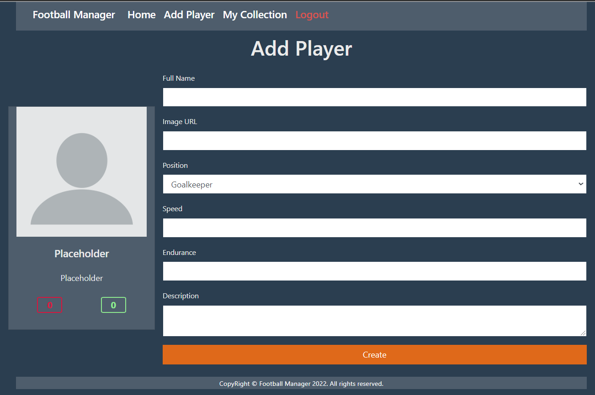

# C# Web Basics Exam -- 20 February 2022 {#c-web-basics-exam-20-february-2022 .unnumbered}

# Football Manager {#football-manager .unnumbered}

Exam problems for the [C# Web Basics course @
SoftUni](https://softuni.bg/trainings/3593/csharp-web-basics-basics-january-2022).
Submit your solutions in the **SoftUni judge** system (delete all
\"**bin**\"/\"**obj**\" folders).

**Football Manager** is an online platform that is used to create and
collect football players.

## Technological Requirements

-   Use the **MyWebServer -- 5.0**

-   Use the **BasicWebServer.Server -- 6.0**

The Technological Requirements are **ABSOLUTE**. If you do not follow
them, you will **NOT** be scored for other Requirements. All the **NuGet
packages** which are **necessary** to solve the exam are installed.

Now that you know the **Technological Requirements**, let us see what
the **Functional Requirements** are.

## Database Requirements

The **Database** of **Football Manager**:

### User  {#user .unnumbered}

-   Has an **Id** -- a **string, Primary Key**

-   Has a **Username** -- a **string** with **min length** **5** and
    **max length 20** (**required**)

-   Has an **Email** -- a **string** with **min length** **10** and
    **max length 60** (**required**)

```{=html}
<!-- -->
```
-   Has a **Password** -- a **string** with **min length** **5** and
    **max length 20 (before hashed)** **- no max length required for a
    hashed password** in the database (**required**)

-   Has **UserPlayers** collection

### Player {#player .unnumbered}

-   Has **Id** -- an **int, Primary Key**

-   Has **FullName** -- a **string** (**required**); min. length: 5,
    max. length: 80

-   Has **ImageUrl** -- a **string** (**required**)

-   Has **Position** -- a **string** (**required**); min. length: 5,
    max. length: 20

-   Has **Speed** -- a **byte** (**required**); cannot be negative or
    **bigger than 10**

-   Has **Endurance** -- a **byte** (**required**); cannot be negative
    or **bigger than 10**

-   Has a **Description** -- a **string** with **max length 200**
    (**required**)

-   Has **UserPlayers** collection

### UserPlayer {#userplayer .unnumbered}

-   Has **UserId** -- a **string**

-   Has **User** -- a **User** object

-   Has **PlayerId** -- an **int**

-   Has **Player** -- a **Player** object

Implement the entities with the **correct datatypes** and their
**relations**.

## Page Requirements

### Index Page (logged-out user) {#index-page-logged-out-user .unnumbered}

{width="7.150146544181977in"
height="1.8075787401574803in"}

### Login Page (logged-out user) {#login-page-logged-out-user .unnumbered}

{width="7.066235783027121in"
height="2.637564523184602in"}

### Register Page (logged-out user) {#register-page-logged-out-user .unnumbered}

{width="7.118663604549432in"
height="3.7152121609798776in"}

### /Players/All (logged-in user) {#playersall-logged-in-user .unnumbered}

{width="7.246527777777778in"
height="3.3631944444444444in"}

**NOTE**: If the user is logged in and tries to go to the home page, the
application must redirect him to the **/Players/All**

### /Players/Collection (logged-in user) {#playerscollection-logged-in-user .unnumbered}

{width="7.246527777777778in"
height="3.477777777777778in"}

### /Players/Add (logged-in user) {width="7.246527777777778in" height="4.819444444444445in"} {#playersadd-logged-in-user .unnumbered}

**Note:** If the Image URL link is too long, the server can not bind it
properly, and null appears.

### /Players/AddToCollection?playerId={playerId} (logged-in user) {#playersaddtocollectionplayeridplayerid-logged-in-user .unnumbered}

Adds the selected player to the user's collection of players. If the
player is already in their collection, it shouldn't be added. If
everything is successful, the user must be redirected to the home
(\"/Players/All\") page.

### /Players/RemoveFromCollection?playerId={playerId} (logged-in user) {#playersremovefromcollectionplayeridplayerid-logged-in-user .unnumbered}

Removes the selected player from the user's collection of players. If
everything is successful, the user must be redirected to their
collection (\"/Players/Collection\") page.

**NOTE**: The templates should look **EXACTLY** as shown above.

**NOTE**: The templates do **NOT** **require** **additional** **CSS**
for you to write. Only **bootstrap** and the **given CSS** are enough.

## Functionality

The functionality of the **Football Manager** Platform is very simple.

### Users {#users .unnumbered}

**Guests** can **Register**, **Login,** and view the **Index** **Page**.

**Users** can **Add Players** and see added **Players** on the **Home**
**Page**. From the **Home** **Page,** they can also view **Info** about
each one of those **Players** and **Add** them to their collection.

### Players {#players .unnumbered}

**Players** can be **Added** by **Users**. When the **User** adds a
**Player**, it has to be added to their collection too. All created
**Players** are visualized on the **Home** **Page**, each one in its
separate rectangular element.

**Players** are visualized on the **Home** **Page** with all their
information. The description shows as a tooltip when their name hovers.

**Players** are visualized on the **Home** **Page** with a button --
\[**Add to Collection**\].

-   The \[**Add to Collection**\] button adds the **Player** to the
    **User**'s collection of **Players** **unless it is already
    contained**.

**Users** have a **Collection** page where only the **Players** in their
collection are visualized.

-   The \[**Remove from Collection**\] button removes the **Player**
    from the **User**'s collection of **Players**.

### Redirections {#redirections .unnumbered}

-   Upon successful **Registration** of a **User**, you should be
    redirected to the **Login** **Page**.

-   Upon successful **Login** of a **User**, you should be redirected to
    the /**Players/All**.

-   Upon successful **Creation** of a **Player**, you should be
    redirected to the /**Players/All**.

-   Upon successful **Adding** a **Player** to the **User**'s
    collection, should be redirected to the /**Players/All**.

-   Upon successful **Removal** of a **Player** from the **User**'s
    collection, should be redirected to the /**Players/Collection**.

-   If a **User** tries to **add** an **already contained** **Player**
    to their **collection**, they should be redirected to
    **/Players/All** (or just a page refresh).

-   Upon successful **Logout** of a **User**, you should be redirected
    to the **Index** **Page**.

-   If any of the **validations** in the POST forms **don't pass**,
    **redirect** to the **same page** (**reload/refresh** it).

## Security

The **Security** section mainly describes access requirements.
Configurations about which users can access specific functionalities and
pages:

-   **Guest** (not logged in) users can access the **Index** page.

-   **Guest** (not logged in) users can access the **Login** page.

-   **Guest** (not logged in) users can access the **Register** page.

-   **Guests** (not logged in) cannot access **Users-only** pages.

-   **Users** (logged in) cannot access **Guest** pages.

-   **Users** (logged in) can access the **Players Add** page and
    functionality.

-   **Users** (logged in) can access the **Players All** page.

-   **Users** (logged in) can access the **Players Collection** page.

-   **Users** (logged in) can access **Logout** functionality.

## Code Quality

Make sure you provide the best architecture possible. Structure your
code into different classes, follow the principles of high-quality code
(**SOLID**). You will be scored for the **Code** **Quality** and
**Architecture** of your project.

## Scoring

### Database Requirements -- 10 points. {#database-requirements-10-points. .unnumbered}

### Template Requirements -- 10 points. {#template-requirements-10-points. .unnumbered}

### Functionality -- 50 points. {#functionality-50-points. .unnumbered}

### Security -- 10 points. {#security-10-points. .unnumbered}

### Code Quality -- 10 points. {#code-quality-10-points. .unnumbered}

### Data Validation -- 10 points. {#data-validation-10-points. .unnumbered}
