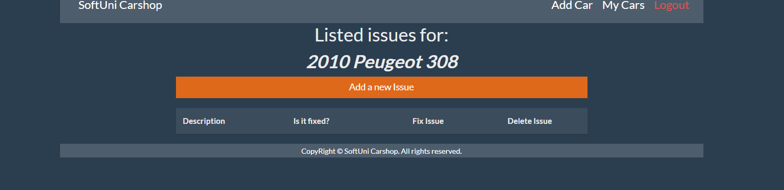

# C# Web Basics Retake Exam - 23 December 2020

# Car Shop

Exam problems for the [C# Web Basics course @
SoftUni](https://softuni.bg/courses/csharp-web-basics). Submit your
solutions in the **SoftUni judge** system (delete all
\"**bin**\"/\"**obj**\" folders).

**SoftUni Car shop** is the newest and hottest place to tune up your car
or fix any outstanding issues.

## Technological Requirements

-   Use the **SUS**

-   Use **Entity Framework Core - 3.1**

The Technological Requirements are **ABSOLUTE**. If you do not follow
them, you will **NOT** be scored for other Requirements.

Now that you know the **Technological Requirements**, let us see what
the **Functional Requirements** are.

## Database Requirements

The **Database** of **SoftUni Car shop** needs to support **3
entities**:

### User 

-   Has an **Id** - a **string, Primary Key**

-   Has a **Username - a string** with **min length** **4** and **max
    length 20** (**required**)

-   Has an **Email - a string** (**required**)

-   Has a **Password - a string** with **min length** **5** and **max
    length 20** **- hashed in the database** (**required**)

-   Has а **IsMechanic** - a **bool** indicating if the user is a
    mechanic or a client

### Car 

-   Has an **Id** - a **string, Primary Key**

-   Has a **Model** - **a string** with **min length** **5** and **max
    length 20** (**required**)

-   Has a **Year** - a **number** (**required**)

-   Has a **PictureUrl** - **string** (**required**)

-   Has a **PlateNumber** - a **string -** Must be a valid Plate
    number (2 Capital English letters, followed by 4 digits, followed by
    2 Capital English letters **(required)**

-   Has a **OwnerId** - a **string** (**required**)

-   Has a **Owner** - a **User** object

-   Has **Issues** collection - an **Issue** type

### Issue 

-   Has an **Id** - a **string**, **Primary Key**

-   Has a **Description** - **a string** with **min length** **5**
    (**required**)

-   Has a **IsFixed - a bool** indicating if the issue has been fixed
    or not (**required**)

-   Has a **CarId** - a **string** (**required**)

-   Has **Car** - a **Car** object

Implement the entities with the **correct datatypes** and their
**relations**.

## Page Requirements

### Index Page (logged-out user) 

### Login Page (logged-out user) 

### Register Page (logged-out user)

### /Cars/All (logged-in user)

[**NOTE**: If the user is logged in and he tries to go the home page,
the application must redirect him to the **/Cars/All**]

### /Cars/Add (logged-in user that is a client)

### /Issues/CarIssues?CarId={id} (logged-in user) 

### /Issues/Add?CarId={id} (logged-in user)

**/Issues/Delete?issueId={Id}&CarId={Id}** The Delete button deletes the
respective issue. Both the owner of the car and a mechanic can delete an
issue.

**/Issues/Fix?issueId={Id}&CarId={Id}** The Fix Issue button changes the
value in the ***Is it fixed?*** Column to ***Yes.*** [Only users that
are mechanics can fix issues.]

If pressing a button is successful, reload the page.

**NOTE**: The templates should look **EXACTLY** as shown above.

**NOTE**: The templates do **NOT** **require** **additional** **CSS**
for you to write. Only **bootstrap** and the **given css** are enough.

## Functionality

The functionality of **Car shop** platform is very simple.

### Users 

**Guests** can see **Register,** **Login** and **Home** views.

**There are two kinds of Users** for this app:

-   **Clients** (isMechanic=false) can **add new cars**. Clients can see
    **all** **the cars they have added but not the cars of other clients
    on the Cars/All page**. For every car, they have added they can also
    view the list of issues and they can add or delete issues. **They
    cannot fix issues.**

-   **Mechanics** (isMechanic=true) **cannot add new cars.** On the
    Cars/All page, they can **view all cars that have unfixed issues**.
    For every car, they can also view the list of issues, add and delete
    issues. Unlike clients **- mechanics can fix an issue** (set
    isFixed to true).

### Cars 

**Clients can add cars**. All cars that the currently logged in user has
access to are visualized on the **[all cars page]**, each
one in its own bootstrap card (as shown in the /Cars/All snapshot
above).

Each car has **Image, model and year** (on hover), **Plate number**,
count of **Fixed Issues** and count of **unfixed (Remaining) issues**
and a **Check issues** button.

**Cars** are visualized on the **My Cars page** with a button -
\[**Check issues**\].

-   The \[**Check issues**\] button leads to the **list of issues
    (/Issues/CarIssues?CarId={Id}** page for the particular car.

### **Issues** 

**Users can add issues on all cars they have access to**. All **issues
for a particular car** are visualized in a table on the **car issues
page**.

There is a button on top of the issues table- \[**Add a new Issue**\].

-   The \[**Add a new Issue**\] button leads to the **add issue view
    (/Issues/Add?CarId= {Id})**.

There are two other buttons \[**Fix Issue**\] and \[**Delete Issue**\]

-   The \[**Fix Issue**\] sets the isFixed property of the respective
    issue to true and reloads the page.

-   The \[**Delete Issue**\] button deletes the respective issue from
    the database and reloads the page.

### Redirections

-   Upon successful **registration** of a **User**, redirect to the
    **Login** **Page**.

-   Upon successful **login** of a **User**, redirect to the
    /**Cars/All**.

-   Upon successful **creation** of **a** **Car**, redirect to the
    /**Cars/All**.

-   Upon successfully **adding an issue to a car**, redirect to the
    /**Issues/CarIssues?carId={Id}** (reload the page)

-   Upon successful **deletion** of **an issue**, redirect to the
    /**Issues/CarIssues?carId={Id}** (reload the page)

-   If any of the validations in the POST forms do not pass, show the
    built-in SUS Error with an appropriate message.

## Security

The **Security** section mainly describes access requirements.
Configurations about which users can access specific functionalities and
pages:

-   **Guest** (not logged in) users **can** access **Index** page.

-   **Guest** (not logged in) users **can** access **Login** page.

-   **Guest** (not logged in) users **can** access **Register** page.

-   **Users** (logged in) **cannot** access **Guest** pages.

-   **Users** (logged in) **can** access **Cars/All** page and
    functionality.

-   **Users** (logged in - **clients**) **can** access **Cars/Add**
    page.

-   **Users** (logged in - **mechanics**) **cannot** access
    **Cars/Add** page.

-   **Users** (logged in) **can** access **Issues/CarIssues** to add or
    delete an Issue.

-   **Users** (logged in - **mechanics**) **can** use the **Fix Issue**
    functionality.

-   **Users** (logged in - **clients**) **cannot** use the **Fix Issue**
    functionality.

-   **Users** (logged in) **can** access **Logout** functionality.

## Code Quality

Make sure you provide the best architecture possible. Structure your
code into different classes; follow the principles of high-quality code
(**SOLID**). You will be scored for the **Code** **Quality** and
**Architecture** of your project.

## Scoring

### Database Requirements - 10 points.

### Template Requirements - 10 points.

### Functionality - 50 points.

### Security - 10 points.

### Code Quality - 15 points.

### Data Validation - 5 points.
