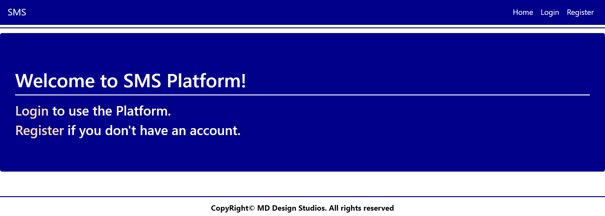

# C# Web Basics Retake Exam - 24 August 2021

# SMS

Exam problems for the [C# Web Basics course @
SoftUni](https://softuni.bg/courses/csharp-web-basics). Submit your
solutions in the **SoftUni judge** system (delete all
\"**bin**\"/\"**obj**\" folders).

**SMS (S**uper**M**arket **S**ystem**)** is an online supermarket for
shopping. You have been tasked to implement a platform in which the
users can add products to their cart and buy them.

## Technological Requirements

-   Use the **MyWebServer**

-   Use **Entity Framework Core - 5.0.7** (for the **new framework**)

-   Use **Entity Framework Core - 3.1.3** (for the **old framework**)

The Technological Requirements are **ABSOLUTE**. If you do not follow
them, you will **NOT** be scored for other Requirements.

Now that you know the **Technological Requirements**, let us see what
the **Functional Requirements** are.

## Database Requirements

The **Database** of **SMS** needs to support **3 entities**:

### User

-   Has an **Id** - a **string, Primary Key**

-   Has a **Username** - a **string** with **min length** **5** and
    **max length 20** (**required**)

-   Has an **Email** - a **string,** which holds only **valid** email
    (**required**)

-   Has a **Password -** a **string** with **min length** **6** and
    **max length 20 - hashed** in the database (**required**)

-   Has a **Cart -** a **Cart** object (**required**)

### Product

-   Has an **Id** - a **string, Primary Key**

-   Has a **Name** - a **string** with **min length** **4** and **max
    length 20** (**required**)

-   Has **Price** - a **decimal** (in **range 0.05**  **1000**)

-   Has a **Cart** - a **Cart** object

### Cart

-   Has an **Id** - a **string, Primary Key**

-   Has **User** - a **User** object (**required**)

-   Has **Products** - a **collection of Products**

Implement the entities with the **correct datatypes** and their
**relations**.

## Page Requirements

### Index Page (logged-out user)

### /Users/Login (logged-out user)

### /Users/Register (logged-out user)

**NOTE**: Upon **successful** registration, a **Cart** for the **User**
is **created** automatically.

### Home Page (logged-in user)

**NOTE**: The \[**Add to Cart**\] adds the **Product** to **User\'s
Cart**.

### Products/Create (logged-in user) 

### Carts/Details (logged-in user)

**NOTE**: All **Products** for the current logged in **User\'s Cart**
are rendered below.

**NOTE**: The templates should look **EXACTLY** as shown above.

**NOTE**: The templates do **NOT** **require** **additional** **CSS**
for you to write. Only **bootstrap** and the **given css** are enough.

**NOTE**: If any of the **validations** in the POST forms **don\'t
pass** you can **redirect** to the **same page** (**reload/refresh** it)
or visualize the **Error page** with **appropriate error message**.

## Functionality

The functionality of **SMS** Platform is very simple.

### Users

**Guests** can **Register**, **Login** and view the **Index** **Page**.

**Users** can **Create** **Products** and see **All Products** on the
**Home** **Page**. From the **Home** **Page** they can also **Add
Products** and view **Details** about their **Cart** and **buy all
Products**.

### Products

**Products** can be **Created** by **Users**. All created **Products**
are visualized on the **Home** **Page**.

**Products** are visualized on the **Home** **Page** as a table with
**Name** of the **Product**, **Price** and action **Add to Cart**.

### Cart

**Products** added are stored in the **User\'s Cart**. In **Cart Details
Page**, **User** can **buy the products**.

When **User** decides to **buy the products in his cart**, the **Cart**
becomes **empty** (products are deleted).

### Redirections 

-   Upon successful **Registration** of a **User**, you should be
    redirected to the **Login** **Page**.

-   Upon successful **Login** of a **User**, you should be redirected to
    the **Home** **Page**.

-   Upon successful **Creation** of a **Product**, you should be
    redirected to the **Home** **Page**.

-   Upon successful **Adding to Cart**, you should be redirected to the
    **Cart Details Page**.

-   Upon successful **Buying**, you should be redirected to the **Home**
    **Page**.

-   Upon successful **Logout** of a **User**, you should be redirected
    to the **Index** **Page**.

## Security

The **Security** section mainly describes access requirements.
Configurations about which users can access specific functionalities and
pages:

-   **Guest** (not logged in) users can access **Index** page.

-   **Guest** (not logged in) users can access **Login** page.

-   **Guest** (not logged in) users can access **Register** page.

-   **Users** (logged in) cannot access **Guest** pages.

-   **Users** (logged in) cannot access **Login** pages.

-   **Users** (logged in) cannot access **Register** pages.

-   **Users** (logged in) can access **Home** page.

-   **Users** (logged in) can access **Product** **Create** page and
    functionality.

-   **Users** (logged in) can access **Cart** **Details** page and
    functionality.

-   **Users** (logged in) can access **Logout** functionality.

## Code Quality

Make sure you provide the best architecture possible. Structure your
code into different classes, follow the principles of high-quality code
(**SOLID**). You will be scored for the **Code** **Quality** and
**Architecture** of your project.

## Scoring

### Database Requirements - 10 points.

### Template Requirements - 10 points.

### Functionality - 50 points.

### Security - 10 points.

### Code Quality - 10 points.

### Data Validation - 10 points.
