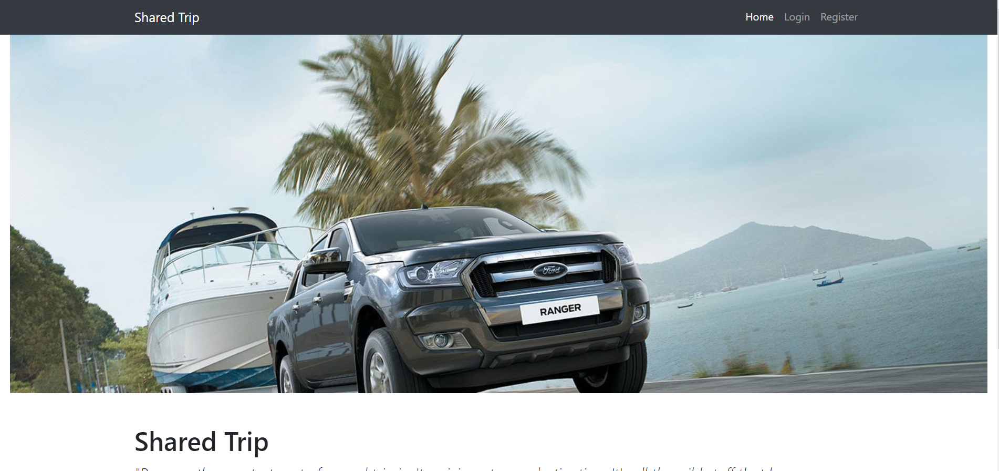
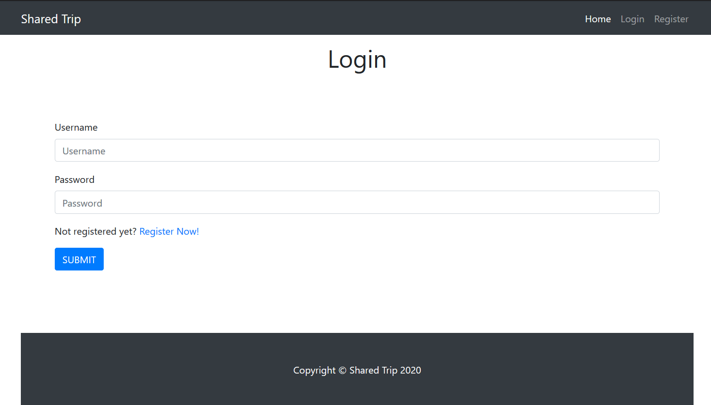
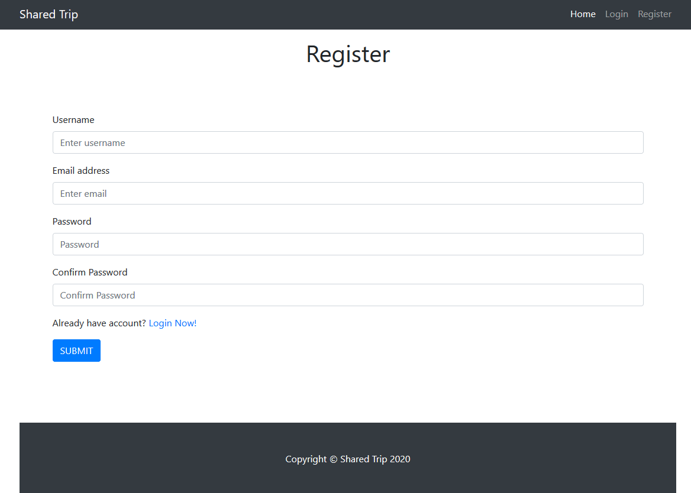
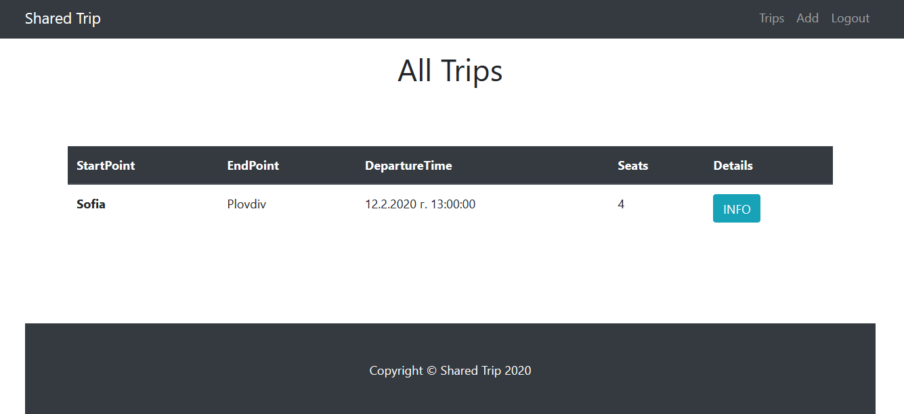
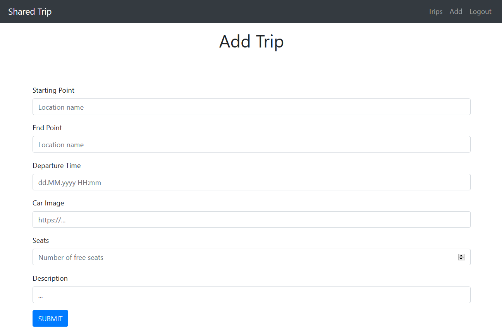
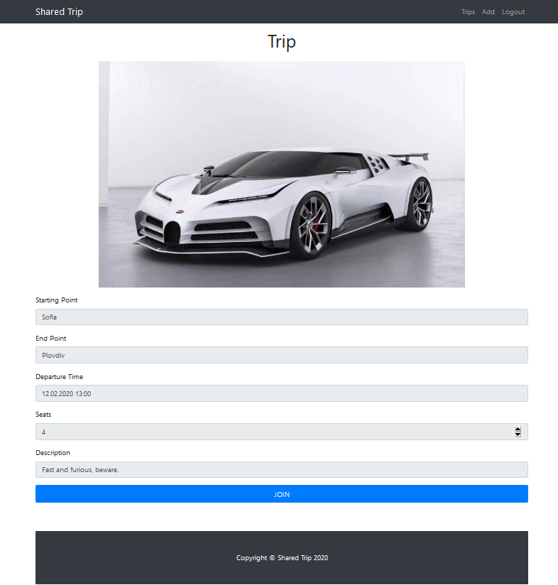

# C# Web Basics Exam - 26 Jun 2021

# Shared Trip

Submit your solutions in the **SoftUni judge** system (delete all
\"**bin**\"/\"**obj**\" folders).

**Shared Trip** is an online platform that is used to create and book
trips from point to point.

## Technological Requirements

-   Use the **MyWebServer**

-   Use **Entity Framework Core - 5.0.7**

The Technological Requirements are **ABSOLUTE**. If you do not follow
them, you will **NOT** be scored for other Requirements.

Now that you know the **Technological Requirements**, let us see what
the **Functional Requirements** are.

## Database Requirements

The **Database** of **SharedTrip** needs to support **3 entities**:

### User

-   Has an **Id** - a **string, Primary Key**

-   Has a **Username** - a **string** with **min length** **5** and
    **max length 20** (**required**)

-   Has an **Email** - a **string** (**required**)

-   Has a **Password** - a **string** with **min length** **6** and
    **max length 20** **- hashed** in the database (**required**)

-   Has **UserTrips** collection - a **UserTrip** type

### Trip

-   Has an **Id** - a **string, Primary Key**

-   Has a **StartPoint** - a **string** (**required**)

-   Has a **EndPoint** - a **string** (**required**)

-   Has a **DepartureTime** - a **datetime** (**required**)

-   Has a **Seats** - an **integer** with **min value 2** and **max
    value 6** (**required**)

-   Has a **Description** - a **string** with **max length 80**
    (**required**)

-   Has a **ImagePath** - a **string**

-   Has **UserTrips** collection - a **UserTrip** type

### UserTrip

-   Has **UserId** - a **string**

-   Has **User** - a **User** object

-   Has **TripId**- a **string**

-   Has **Trip** - a **Trip** object

Implement the entities with the **correct datatypes** and their
**relations**.

## Page Requirements

### Index Page (logged-out user)

### Login Page (logged-out user)

### Register Page (logged-out user)

### /Trips/All (logged-in user)

**NOTE**: If the user is logged in and tries to go to the home page, the
application must redirect him to the **/Trips/All**

### /Trips/Add (logged-in user) 

### /Trips/Details?tripId={tripId} (logged-in user) 

### /Trips/AddUserToTrip?tripId={tripId} (logged-in user)

Adds the current user to the given trip. If everything is successful,
the user must be redirected to the home page.

**NOTE**: The templates should look **EXACTLY** as shown above. The
dates are only examples and they do not need to be the same as in the
provided examples.

**NOTE**: All dates in the application must be in the format:
\"**dd.MM.yyyy HH:mm**\"

**NOTE**: The templates do **NOT** **require** **additional** **CSS**
for you to write. Only **bootstrap** and the **given css** are enough.

## Functionality

The functionality of **SharedTrip** Platform is very simple.

### Users

**Guests** can **Register**, **Login** and view the **Index** **Page**.

**Users** can **Add Trips** and see **Added** **Trips** on the **Home**
**Page**. From the **Home** **Page,** they can also view **Info** about
each one of those **Trips** and **Join** in a **Trip**.

### Trips

**Trips** can be **Added** by **Users**. All created **Trips** are
visualized on the **Home** **Page**, each one in its separate
rectangular element.

**Trips** are visualized on the **Home** **Page** as a table with
**StartPoint**, **EndPoint, DepartureTime, Seats (the currently free
Seats), Details** and action **Info**.

**Trips** are visualized on the **Home** **Page** with a button -
\[**Info**\].

-   The \[**Info**\] button leads to the **Details** **Page** of the
    trip

**Trips** have **Details** **Page**, where the information about them is
displayed. At the bottom, there is one button, which is Join. Upon
pressing it, the **User** joins the **Trip**. A **User** can join the
**Trip** just once! You should display the **currently free seats**.

### Redirections

-   Upon successful **Registration** of a **User**, you should be
    redirected to the **Login** **Page**.

-   Upon successful **Login** of a **User**, you should be redirected to
    the /**Trips/All**.

-   Upon successful **Creation** of a **Trip**, you should be redirected
    to the /**Trips/All**.

-   Upon successful **Adding a user to a trip**, should be redirected to
    the /**Trips/All**.

-   If any of the **validations** in the POST forms **don't pass**,
    **redirect** to the **same page** (**reload/refresh** it).

-   If a **User** tries to join a **Trip** more than once, they should
    be redirected to the **details page** of the given **Trip**.

## Security

The **Security** section mainly describes access requirements.
Configurations about which users can access specific functionalities and
pages:

-   **Guest** (not logged in) users can access **Index** page.

-   **Guest** (not logged in) users can access **Login** page.

-   **Guest** (not logged in) users can access **Register** page.

-   **Users** (logged in) cannot access **Guest** pages.

-   **Users** (logged in) can access **Trip Add** page and
    functionality.

-   **Users** (logged in) can access **Trip Details** page.

-   **Users** (logged in) can access **Trips All** page and
    functionality.

-   **Users** (logged in) can access **Logout** functionality.

## Code Quality

Make sure you provide the best architecture possible. Structure your
code into different classes, follow the principles of high-quality code
(**SOLID**). You will be scored for the **Code** **Quality** and
**Architecture** of your project.

## Scoring

### Database Requirements - 10 points.

### Template Requirements - 10 points.

### Functionality - 50 points.

### Security - 10 points.

### Code Quality - 10 points.

### Data Validation - 10 points.
